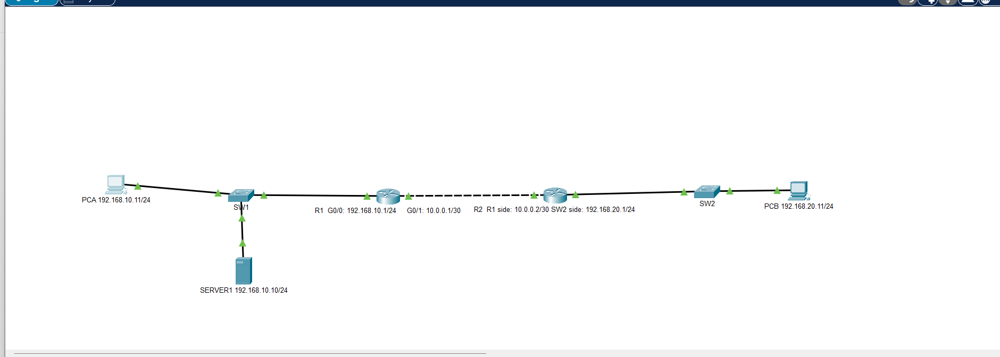
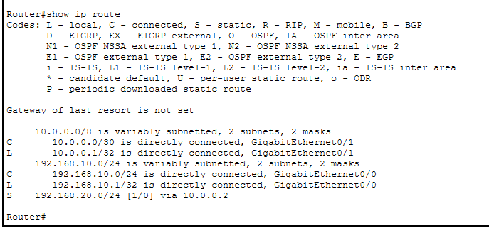
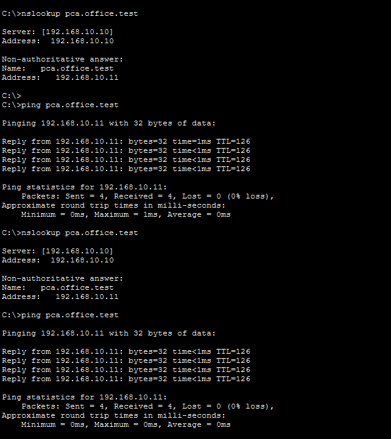

# Small Office Network with DNS and Static Routing

This project demonstrates the design and configuration of a small office network using Cisco Packet Tracer.

The network consists of two separate LANs connected through two routers. Static routing provides communication between the networks, while a DNS server provides hostname resolution for the end devices.

## Network Topology



The topology includes:

- 2 Cisco routers
- 2 switches
- 2 PCs
- 1 DNS server
- 2 office LANs
- 1 point-to-point transit network

## IP Addressing

| Device | Interface / Role | IP Address | Subnet Mask |
|---|---|---|---|
| R1 | Office A LAN | 192.168.10.1 | 255.255.255.0 |
| R1 | R1-R2 Transit | 10.0.0.1 | 255.255.255.252 |
| R2 | R1-R2 Transit | 10.0.0.2 | 255.255.255.252 |
| R2 | Office B LAN | 192.168.20.1 | 255.255.255.0 |
| PCA | Office A Client | 192.168.10.11 | 255.255.255.0 |
| DNS Server | DNS Server | 192.168.10.10 | 255.255.255.0 |
| PCB | Office B Client | 192.168.20.11 | 255.255.255.0 |

## Default Gateways

- PCA: `192.168.10.1`
- DNS Server: `192.168.10.1`
- PCB: `192.168.20.1`

## Transit Network

The two routers are connected using the following transit network:

```text
10.0.0.0/30
```

Usable addresses:

```text
10.0.0.1 → R1
10.0.0.2 → R2
```

A `/30` subnet was used because only two usable IP addresses are required for the point-to-point router connection.

## Static Routing

R1 uses the following static route to reach Office B:

```text
ip route 192.168.20.0 255.255.255.0 10.0.0.2
```

R2 uses the following static route to reach Office A:

```text
ip route 192.168.10.0 255.255.255.0 10.0.0.1
```

The routing table confirms that the remote network is reachable through the configured next hop.



## DNS Configuration

The DNS server is located at:

```text
192.168.10.10
```

The following DNS A records were configured:

| Hostname | IP Address |
|---|---|
| `pca.office.test` | `192.168.10.11` |
| `pcb.office.test` | `192.168.20.11` |

Both clients use the DNS server at:

```text
192.168.10.10
```

## DNS and Connectivity Verification

DNS resolution was verified using:

```text
nslookup pca.office.test
```

The hostname successfully resolved to:

```text
192.168.10.11
```

End-to-end connectivity was then verified using:

```text
ping pca.office.test
```



## Troubleshooting

During the project, several connectivity issues were diagnosed using Cisco IOS commands and Packet Tracer tools.

Commands used included:

```text
show ip interface brief
show ip route
show arp
show mac address-table dynamic
show interface
```

Packet Tracer Simulation Mode was also used to inspect ARP traffic and determine where packets were being dropped.

One issue was caused by an incorrect router interface IP address. During ARP inspection, the router identified the sender as belonging to a different network and dropped the frame. Correcting the interface IP address resolved the problem.

The troubleshooting process reinforced the relationship between:

- Layer 1 connectivity
- MAC address learning
- ARP
- IPv4 addressing
- Default gateways
- Static routing
- DNS resolution
- ICMP testing

## Skills Practiced

- Cisco IOS CLI
- IPv4 addressing
- `/24` and `/30` subnetting
- Router interface configuration
- Default gateway configuration
- Static routing
- DNS server configuration
- DNS A records
- Hostname resolution
- ARP analysis
- MAC address table analysis
- ICMP connectivity testing
- Network troubleshooting
- Cisco Packet Tracer Simulation Mode

## Project Files

- `small-office-network-dns-routing.pkt`
- `topology.png`
- `routing-table.png`
- `dns-verification.png`

## Tools

- Cisco Packet Tracer
- Cisco IOS CLI

## Purpose

This project was created to strengthen foundational networking skills and build practical experience before progressing further into cybersecurity, network security, and infrastructure security.
